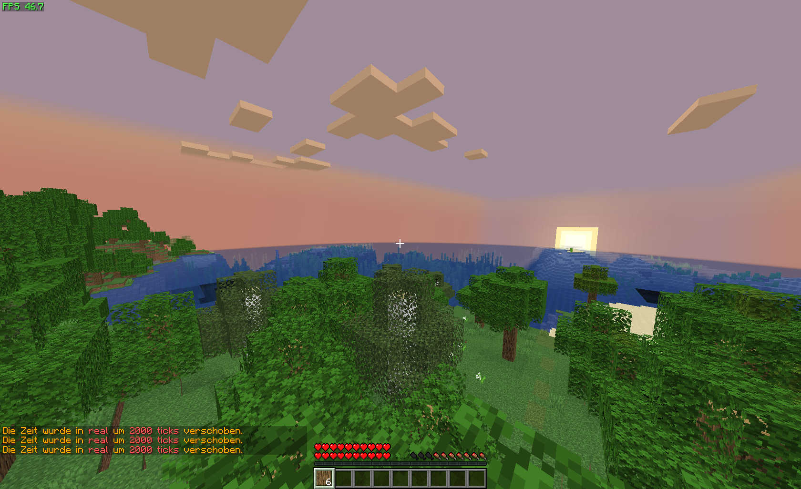

# Minosoft

Minosoft is an open source minecraft client, written from scratch in kotlin (and java). It aims to bring more functionality and stability.  
(This is not a classical clone of minecraft, it completely re implements it!)  
(This software is not affiliated with Mojang AB, the original developer of Minecraft)

<h2>Notice: I am *not* responsible for anti cheat banned accounts, this project is heavily in development!</h2>

## Feature overview

- Rendering
- Connect with any version to any server  (1.7 - 1.20.2)
- [Bleeding edge performance (e.g. incredible start time)](/doc/Performance.md)
- Free (as far as we consider original minecraft as free) and open source
- Easy use of multiple accounts
- Multiple connections to servers in 1 process
- Multithreading and asynchronous loading
- [Original physics](/doc/Physics.md)
- Debugging on protocol layer
- LAN servers
- Multiple profiles (i.e. settings for servers or minosoft in general)
- Modding
- Independent, I will probably accept almost all patches
- [Headless mode](/doc/Headless.md)
- Way more stuff

(some ~~technical~~ explanation about the render system is [here](/doc/rendering/ReadMe.md)). You can find information about the architecture design [here](/doc/Architecture.md)

## System requirements

- CPU: Multiple (4+) cores, high clock speed (2+ GHz)
- RAM: Minimum 500 MiB, 1 GiB recommended
- Disk space: 80 MiB + assets (~ 300 MiB per version)
- GPU: OpenGL 3.3+. Every modern GPU works and is recommended.
- Java 11+, 16+ recommended (Java 8 is **not** supported).
- A minecraft server (local or online)

## Rendering

### Features

- Blocks
- Entities (hitboxes and players for now)
- Block entities (e.g. signs, chests)
- HUD and GUI (inventory, menus, ...)
- Particles
- Basic block and skylight (custom light engine)
- Block and item interactions (e.g. place, break, mining)
- A lot more, only listing major things here, see the screenshots:

  
A world, with a ton of hud features exposed

  
The Hypixel skyblock hub (don't try to make such a screenshot)

  
AFK Pooling, Hit boxes, particles, ...

  
Lobby of hypixel.net with entities.

A beautiful sunset

  
[Eros](https://en.wikipedia.org/wiki/Eros) is the main gui. You can select your account/favorite server and then connect to it. Once everything is prepared, the rendering will start.

## Version support

I always try to add support for the newest version of minecraft. Mostly it is pretty easy, just declaring it and generate all data. After pushing it, it is supported. Some versions are more complicated and need a bit of coding. I always try it as fast as possible, but sometimes I just need time.

### Supported versions

Almost all versions (and snapshots!) between 1.7 and the latest one (1.20.2 as of writing this) are supported.  
I plan to maintain Minosoft to at least version 1.20, so stay tuned, and support for older protocols will not be dropped as newer protocols are added. It is still recommended using the latest stable version.  
See [Version support](/doc/VersionSupport.md) for more details.

## Modding

Works, still missing some features to make modding super easy (see e.g. [#12](https://gitlab.bixilon.de/bixilon/minosoft/-/issues/12))

### Botting

Will be improved in the future.

## Contribution or helping out

Please do it. I am completely busy with the development. Grab pretty much whatever you want and start developing.
(But before please take a look at [Contributing.md](/Contributing.md))

## Credits and thanking words

See [Credits](Credits.md).

## Releases and beta

No clue. Don't wait for it :)

I invested many thousands of hours in this project to make it "work". A lot of vanillas features are actually implemented, but soo much is missing.
A release normally means, that it is stable, has few (known) bugs and won't change that much in the near future.
All those "requirements" are currently not fulfilled at all. It is just way to alpha atm. The current goal always was to play bedwars with this client and it actually worked on hypixel ([#42](https://gitlab.bixilon.de/bixilon/minosoft/-/issues/42)).

If you want to get notified when cool new features arrive or other interesting stuff happens were, feel free to subscribe to [@MinosoftDevNews](https://t.me/MinosoftDevNews).

## Downloads / Installation

### Linux, Windows, macOS

The latest x64 and arm64 build gets uploaded to github actions. See [github actions](https://github.com/Bixilon/Minosoft/actions/?ref=gitlab.bixilon.de)

#### Arch

Thanks to @jugendhacker you can get minosoft directly from the arch user repository (AUR): https://aur.archlinux.org/packages/minosoft-git/

## Building

1. Install Java 11+ (e.g. `sudo apt install openjdk-11-jdk`). Windows users [download](https://www.azul.com/downloads/?package=jdk#zulu) and install java.
2. Clone this repository (`git clone --depth=1 https://gitlab.bixilon.de/bixilon/minosoft.git`) or click on download master and extract the archive.
3. Change directory (`cd minosoft`)
4. Optional: Checkout a current feature branch (Warning: might be unstable; might not even build) (`git checkout <branch>`)
5. Build and run Minosoft with `./gradlew run` (or on windows `./gradlew.bat run`). Alternatively just click on `run.cmd`. If any errors occur, feel free to contact me or open an issue

## Code mirrors

- [gitlab.bixilon.de](https://gitlab.bixilon.de/bixilon/minosoft/) (Main repository)
- [GitLab](https://gitlab.com/Bixilon/minosoft)
- [GitHub](https://github.com/Bixilon/Minosoft/?ref=gitlab.bixilon.de)

This project/readme is work in progress, things may change over time.
