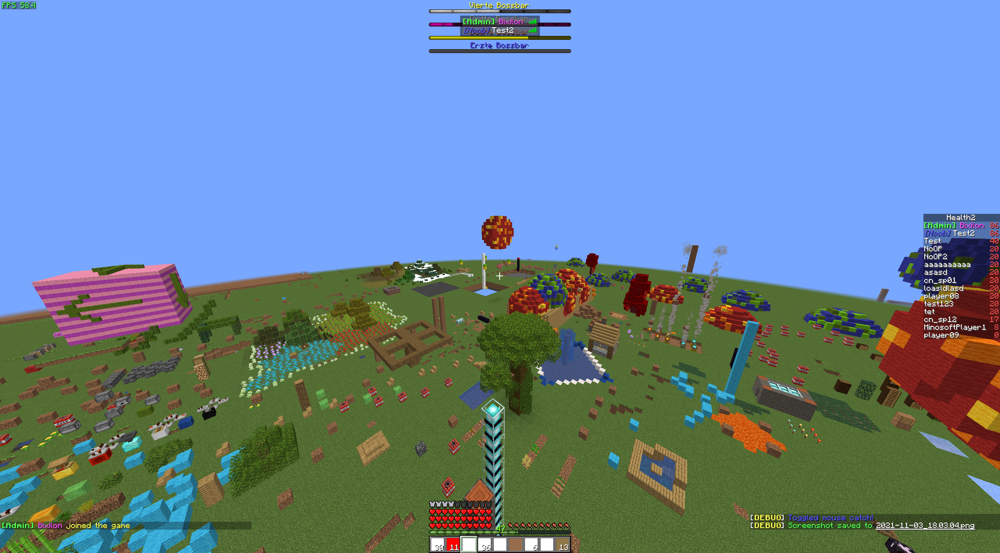

# Minosoft

Minosoft is an open source minecraft client, written from scratch in kotlin (and java). It aims to bring more functionality and stability.  
(To be clear: This is not clone of minecraft, you can see it more like a fork or even better as a reimplementation)

<h2>Notice: I am **not** responsible for anti cheat banned accounts, this project is heavily in development!</h2>
(Also this software is not affiliated with Mojang AB)

## Feature overview

- Rendering
- Connect with any version to any server  (1.7 - latest)
- ~~Modding~~
- Bleeding edge performance (incredible start time of 3 - 5 seconds on modern hardware)
- Free (as far as we consider original minecraft as free) and open source
- Easy use of multiple accounting
- Multiple connections to servers in 1 process
- Multithreading and asynchronous loading
- Debugging on protocol layer
- LAN servers
- Independent, I'd accept almost all types of patches (except explicit server support)
- Way more stuff
- Multiple profiles (i.e. settings for servers or minosoft in general)

## System requirements

- CPU: Minosoft works mostly asynchronous, so multiple cores are good. For FPS more clock speed is better.
- RAM: Minimum 500 MiB, 1 GiB recommended
- Disk space: Minosoft itself is pretty small (a couple of MiB), the libraries take to most binary space (around 80 MiB). Minecraft itself (with its assets) takes about 300 MiB per version.
- GPU: OpenGL 3.3+. Every modern GPU works and is recommended.
- Java 11+, 16+ recommended (Java 8 is **not** supported).

## Rendering

### Features

- Block rendering
- Particles
- Basic light
- Block place, break, mining
- Item and block interaction
- (almost) Original physics
- HUD

  
A world, with a ton of hud features exposed

  
The Hypixel skyblock hub (don't try to make such a screenshot)

  
AFK Pooling, Hit boxes, particles, ...

  
Lighting demo.

  
Particles. (ignore the numbers on the campfire, I've used them to debug animations)

  
[Eros](https://en.wikipedia.org/wiki/Eros) is the main gui. You can select your account/favorite server and then connect to it. Once everything is prepared, the rendering will start.

## Version support

I always try to add support for the newest version of minecraft. Mostly it is pretty easy, just declaring it and generate all data. After pushing it, it is supported. Some versions are more complicated and need a bit of coding. I always try it as fast as possible, but sometimes I just need time.

### Supported versions

Almost all versions (and snapshots!) between 1.7 and the latest one (1.17 as of writing this). I plan to maintain Minosoft to at least version 1.20, so stay tuned, also support for older protocols will not be dropped as newer protocols are added. It is still recommended using the latest stable version.

### Unsupported versions

Minosoft uses [PixLyzer](https://gitlab.bixilon.de/bixilon/pixlyzer) as data source for all kind of data (like block ids, item ids, ...). PixLyzer currently works for 19w12a+ (1.14 snapshot) and 1.12.2 (these mappings are used for 1.7 - 1.12). 1.13 is currently unsupported and won't be in near future.

## Modding

Completely broken -/-

## Botting

Not easily possible, but will be improved in the future.

## Contribution or helping out

Please do it. I am completely busy with the development. Grab pretty much whatever you want and start developing.
(But before please take a look at [Contributing.md](/Contributing.md))

## Tools and generators

I wrote some tools to help out, see [Utility](util/ReadMe.md).

## Credits and thanking words

See [Credits](Credits.md).

## Releases and beta

No clue. Don't wait for it :)

Background: I invested thousands of hours in this project to make it work. It is currently not really playable yet, but I am hardly working on it. A release normally means, that it is stable, has few (known) bugs and won't change that much in the near future. All those "requirements" are currently not fulfilled at all. There are a ton of bugs, issues, part of the core code changes frequently and Minosoft is still missing soooo many features. The current goal is to be able to play bedwars with this client, you can find the tracking issue [here](https://gitlab.bixilon.de/bixilon/minosoft/-/issues/42).

If you want to get notified when cool new features arrive or other interesting stuff happens were, feel free to subscribe to [@MinosoftDevNews](https://t.me/MinosoftDevNews).

## Downloads / Installation

### Linux

The latest x64 build gets uploaded to github actions. See [github actions](https://github.com/Bixilon/Minosoft/actions)

#### Arch

Thanks to @jugendhacker you can get minosoft directly from the arch user repository (AUR): https://aur.archlinux.org/packages/minosoft-git/

### Windows

Build it from source and run it :)

### macOS

Support for macOS is a delicate topic. Let's say it works for now, but it is not convenient to use. Take a look at issue [#29](https://gitlab.bixilon.de/bixilon/minosoft/-/issues/29) for details.

## Building

1. Install Maven and java 11+ (On Ubuntu based distributions: `sudo apt install maven openjdk-11-jdk`). For Windows users, download and install java from oracle or openjdk. Also download maven and follow along
2. Clone this repository (`git clone https://gitlab.bixilon.de/bixilon/minosoft.git`)
3. Change directory (`cd minosoft`)
4. Optional: Checkout a current feature branch (Warning: might be unstable; might not even build) (`git checkout <branch>`)
5. Build and run Minosoft with `mvn clean verify exec:java`. If any errors occur, feel free to open an issue. In this early stage it might be helpful to delete the config file
6. (Optional) Build a fat jar with `mvn package`. You'll find the jar with all dependencies in `target/`. Then you don't need to recompile everytime

## Code mirrors

- [gitlab.bixilon.de](https://gitlab.bixilon.de/bixilon/minosoft/) (Main repository)
- [GitLab](https://gitlab.com/Bixilon/minosoft)
- [GitHub](https://github.com/Bixilon/Minosoft/)

This project/readme is work in progress, things may change over time.
