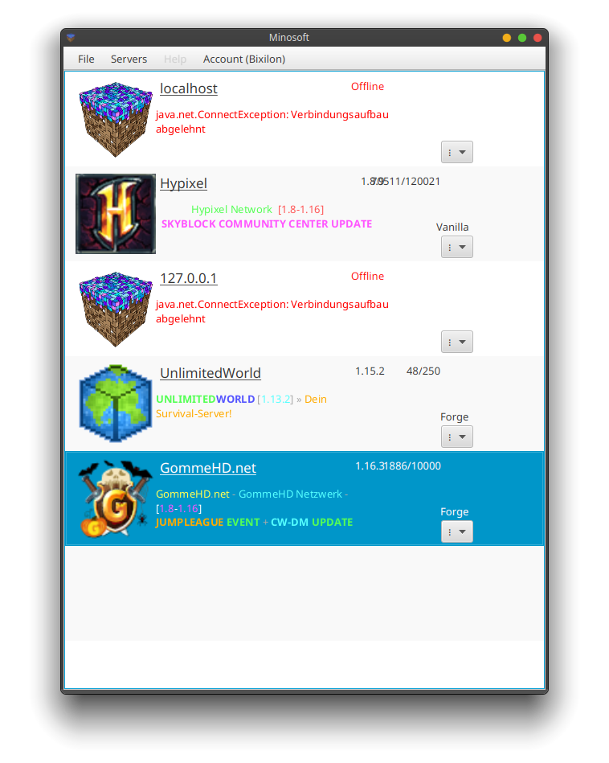

# Minosoft

Minosoft is an open source minecraft client, written from scratch in java. It aims to bring more functionality and stability.

<h2>Notice: I am not responsible for anti cheat banned accounts, this project is heavily in development!</h2>

## Feature overview

- Rendering
- Multi protocol support (1.7 - latest)
- Stable modding API + Unstable modding API
- Bleeding edge performance (incredible start time of 3 - 5 seconds on modern hardware)
- Free (as far as we consider original minecraft as free) and open source
- Multi accounting (also multiple account vendors: Offline, Mojang, Microsoft)
- Multi "sessions" (Connections to a server)
- Multi threading and asynchronous loading
- Debugging on protocol layer
- LAN servers
- Independent, We'd accept almost all types of patches (except explicit server support)
- Way more stuff

## System requirements

- CPU: Minosoft works mostly asynchronous, so multiple cores are good. For FPS more clock speed is better.
- RAM: ~500Mib. With overhead, etc 2Gib recommended
- Disk space: Minosoft itself is pretty small (2-3 Mib), the libraries are a bit bigger. You also need to have the "normal" minecraft assets (~ 300 MB for one version).
- GPU: OpenGL 3.3+. Every moden GPU works and is recommended.
- Java 16 (This is really important, we use features that are only available in this version. Java 8 is currently **not** supported).

## Rendering

Works. Still missing many features, but heavily developed.

  
Lighting demo.

  
Old picture with bugs

  
Picture with hotbar, biomes, biome blending, lighting, fluids, ...

## Starting, etc

There is no "launcher" or anything familiar. Just start Minosoft, and you are practically in the game. You will be greeted with a server list. Once you know what server you want to join, click on it. All data will then be loaded, and the rendering window starts, once everything is done.

## Version support

I always try to add support for the newest version of minecraft. Mostly it is pretty easy, just declaring it and generate all data. After pushing it, it is supported. Some versions are more complicated and need a bit of coding. I always try it as fast as possible, but sometimes I just need time.

### Supported versions

Almost all versions (and snapshots!) between 1.7 and the latest one (21w17a as of writing this, snapshot for 1.17). I plan to maintain Minosoft to at least version 1.20, so stay tuned. Support for older protocols will not be dropped as newer protocols are added. And I can only recommend using the latest stable version.

### Unsupported versions

Minosoft uses [PixLyzer](https://gitlab.bixilon.de/bixilon/pixlyzer) as data source for all kind of data (like block ids, item ids, ...). PixLyzer currently works for 19w12a+ (1.14 snapshot) and 1.12.2 (these mappings are used for 1.7 - 1.12). 1.13 is currently unsupported and won't be in near future.

## Modding

Minosoft is modding friendly. A decent and stable API was introduced with !17. It is pretty final, but some things might still change. See [Modding.md](doc/Modding.md) for more details. The code is pretty dynamic (all blocks, items, entities, etc are stored in json files). It is pretty easy to load custom entities, etc, so adding custom blocks, etc is easily possible. Spoiler: Forge mods are NOT compatible. Feel free to write a compatibility layer (This is a really hard thing, we do things
completely different).

## Botting

On the ToDo List

## Contribution or helping out

You're welcome, but feel free to take a look at [Contributing.md](/Contributing.md).

## Tools and generators

We wrote some tools to help out, see [Utility](util/ReadMe.md).

## Credits

See [Credits](Credits.md).

## Releases and beta

No clue, but still waiting for !21. Also, some features need to be implemented, so not soo soon (but we are getting closer).

## Compiling and running

1. Install Maven and java 15 (On Ubuntu based distributions: `sudo apt install maven openjdk-15-jdk`).
2. Clone this repo (`git clone https://gitlab.bixilon.de/bixilon/minosoft.git`).
3. Change directory (`cd minosoft`).
4. Checkout the branch (`git checkout <branch>`). Eventually `rendering` or `development`.
5. Build and run Minosoft with `mvn clean verify exec:java`. If any errors occur, feel free to open an issue. In this early stage it might be helpful to delete the app data folder (only of minosoft).

## Code mirrors

- [GitLab](https://gitlab.com/Bixilon/minosoft)

This readme is work in progress, things may change over time.
