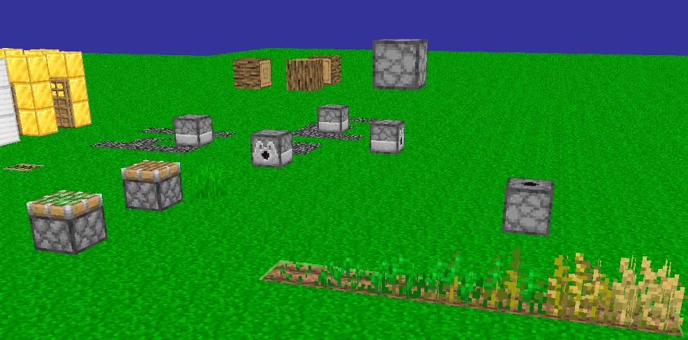

# Minosoft
Minosoft is an open source minecraft client, written from scratch in java. It aims to bring more functionality and stability.

## Feature overview
 - Rendering (WIP)
 - Multi protocol support (1.7 - latest)
 - Modding
 - Fast performance (start time on my laptop: 3 seconds)
 - Free and open source
 - Multi accounting
 - Multi "sessions" (Connections to a server)
 - Multi threading
 - Async loading
 - Debugging on protocol layer

## System requirements
 - CPU: Minosoft benefits from multiple cores (at least for most stuff). CPU is kind of important,
  but for the rendering clock speed is more important. 4 cores recommended with at least 2 Ghz.
 - RAM: Out goal was it to run without compromises on an 8 Gib computer and at least limited on an 4 Gib one.
 - Disk space: Minosoft itself is pretty small (2-3 Mib), the libraries are a bit bigger (up to 100 Mib).
  You also need to have the "normal" minecraft assets (~ 300 Mib). So a total of 500 Mib is recommended.
 - GPU: Currently only needed for rendering, no clue yet.
 - Java 15 (This is really important, we use specific features that are only available in the latest version. Java 8 is **not** supported).
 OpenJDK 15 is (of course) also supported.

## Rendering
Rendering is developed and maintained by Lukas Eisenhauer. It is very WIP, but it works. See !8 for more details.

The current result of rendering (taken in 739f861bf62341698abcd58386c353a4831f4818).

## Launcher
The "Launcher" is not really a launcher, it is just a (badly designed, but functional) Serverlist with account management functionality.
Launcher is in quotation marks, because it is not really a launcher. It is the game. You click on run and see this window. All downloads, loadings, ... happen async in the background.
If you double-click on the server. you can connect to it. Once connected (= Received spawn location), you can play :)

## Version support
I always try to add support for the newest version of minecraft. Mostly it is pretty easy, just add the newest version to the `versions.json` and generate the mappings.
After pushing it, it is supported. Some versions are more complicated and need a bit of coding. I always try it as fast as possible, but sometimes I just need time.
Check out [wiki.vg](https://wiki.vg/Main_Page) for more information.

### Supported versions
Almost all versions are supported, starting with 13w41b (pre 1.7 snapshot) and ending with the newest (1.16.3 as of writing this.)

### Unsupported versions
Sadly, we cannot support all versions. We will add support for all major versions (like 1.8.9, 1.9.4, 1.14.4, etc), but it is simply not possible to support all snapshots.
 - `1.13-pre6`, `1.13-pre5`, `17w50a`, `17w49b`, `17w49a`, `17w48a`, `17w47b`, `17w47a` Missing blocks.json (Mappings)
 - April fools: I will not add any support for them, there are only a few things known. They might work, untested.
 
## Modding
Minosoft is modding friendly. I am working hard on a reasonable API. See !17 for more details. See [Modding.md](doc/Modding.md) for more details. The code is pretty dynamic (all blocks, items, entities, etc are stored in json files). It is pretty easy to load custom entities, etc.
We will add a real modding API once Rendering is complete. Spoiler: Forge mods are NOT compatible. Feel free to write a compatibility layer (This is a really hard thing, we do things completely different).

## Contribution
You're welcome. Because this is pretty much incomplete, contact us before working on it and submitting a pull request.

## Tools
We wrote some tools to help out, see [Utility](util/ReadMe.md).

## Credits
Many thanks to [Credits](Credits.md).

## Releases and beta
We are almost ready to release a beta once !8 is merged.

## Compiling and running
1. Install Maven and java 15 (On Ubuntu based distributions: `sudo apt install maven openjdk-15-jdk`)
2. Clone this repo (`git clone https://gitlab.bixilon.de/bixilon/minosoft.git`)
3. Change directory (`cd minosoft`)
4. Checkout the branch (`git checkout <branch>`). Probably `render`
5. Run Minosoft with `mvn javafx:run`. If any errors occur, feel free to open an issue. In this early stage it might be helpful
 to delete the app data folder (only of minosoft).

This readme is work in progress, things may change over time.
